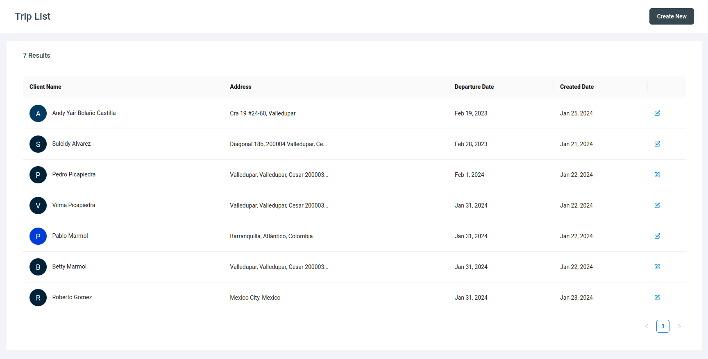

# Trip management Project

## Table of Contents
1. [General Info](#general-info)
2. [Technologies](#technologies)
3. [Installation for Development](#Installation-for-Development)
3. [Installation with docker image](#Installation-with-docker-image)

## General Info
We have here a small application for the management of logistic trips 🚛. You can create a trip specifying the destination.
In addition to this you can have a list of all trips and the possibility to edit each trip.


🔵 View project running: [sol-trip-management](https://sol-trip-management.netlify.app/)



#### Important 📢:
you should know that this project is using the **microfrontend architecture**, making use of an external project called [UI sol-shared-library](https://sol-shared-library.netlify.app/) for the construction of your views.

Here you can see a small scheme to better understand the architecture of this project.


In order to run this project in your local environment you must first follow the [installation instructions](https://github.com/andybolano/sol-shared-library) in the UI sol-shared-library

## Technologies
A list of technologies used within the project:
* [VueJS](https://vuejs.org/): Version 3.2.13 
* [Webpack](https://webpack.js.org/): Version 5.89.0
* [Node.js](https://nodejs.org/): Version 16.0.0

## Installation for Development
⚠️ After following the installation steps of the [sol-shared-library](https://github.com/andybolano/sol-shared-library) project and *make sure it is running smoothly*, 
follow the next steps: 
#### Clone project
```
git clone https://github.com/andybolano/sol-tripManagement.git
```
#### 📁 Move to the project directory 
```
cd trip-management
```

#### 🛠️ Install dependencies
```
npm install
```

#### 🏁 Compiles and hot-reloads for development
```
npm run serve
```

The project is configured by default to run on **port 8082**, so you should view it at the following address on your computer [http://localhost:8082/](http://localhost:8082/) 🏁.

## Installation with docker image 🐋


```
$ git clone https://github.com/andybolano/sol-tripManagement.git
$ cd trip-management
$ ./start.sh
```
if you are using linux environment and you have permissions problems when executing the command ./start.sh
```
chmod +x start.sh
```

The project is configured by default to run on **port 8082**, so you should view it at the following address on your computer [http://localhost:8082/](http://localhost:8082/) 🏁.
